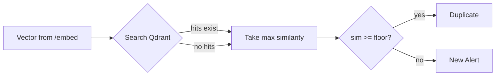

# PhishRadar System Flow (English)

This document describes the full end-to-end flow of PhishRadar: components, data
and control paths, branching, and reliability/observability hooks. Use it as a
quick architecture map and an interview-ready summary.

## Components
- n8n (Cron + HTTP orchestration)
- FastAPI worker (ingest, enrich, embed, dedup, notify, log, hooks, manual feed sync)
- Feed sources: OpenPhish public feed, SinkingYachts API (best-effort)
- Redis (URL seen-cache for feed dedup/caching)
- Ollama (local embeddings; model: `embeddinggemma:latest`)
- Qdrant (vector store; cosine metric; collection: `phishradar_urls`)
- Slack App (chat.postMessage + interactive buttons; signed webhooks)
- BigQuery (events/logs/KPIs; buffered via JSONL loader in PoC)
- Prometheus/OTel (metrics and tracing)

## High-level Flow
```mermaid
flowchart TD
  subgraph Intake
    FEEDS[(OpenPhish<br/>SinkingYachts)]
    SYNC[POST /sources/sync<br/>(manual trigger)]
    QUEUE[[IngestQueue<br/>(buffer/incoming.jsonl)]]
    FEEDS --> SYNC --> QUEUE
  end
  CRON[n8n Cron / 10m] --> F1[POST /ingest/fetch]
  F1 --> ENR[POST /enrich]
  ENR --> EMB[POST /embed (Ollama)]
  EMB --> DED[POST /dedup (Qdrant)]
  DED -->|is_duplicate=true| LOG1[POST /log events_raw]
  DED -->|is_duplicate=false| SLK[POST /notify/slack]
  SLK --> LOG2[POST /log alerts]
  SLACK[Slack Button] --> HOOK[POST /hooks/slack]
  HOOK --> LOG3[POST /log alerts update]
  DED --> QDR[Qdrant]
  EMB --> OLL[Ollama]
  LOG1 --> BQ[BigQuery]
  LOG2 --> BQ
  LOG3 --> BQ
```

## Worker Startup Flow


## Embedding + Dedup Decision
- Embed input: string built from `{url} | {title} | {domain}`.
- Embedding provider: `OllamaEmbeddings.embed_async_single(text)` with timeouts + retries.
- Decision rule:
  - Search Qdrant top_k=5 with preference for same-domain neighbors.
  - Let `similarity` = max score among hits (cosine similarity in [0,1]).
  - Duplicate if similarity passes the floor:
    - Same-domain: `similarity >= DEDUP_SAME_DOMAIN_MIN_SIM` (default 0.94)
    - Cross-domain: `similarity >= DEDUP_GLOBAL_MIN_SIM` (default 1.001 — effectively disabled)
  - Always upsert (idempotent UUIDv5(URL)) so history/idempotency is preserved.



## Slack Actions


## Error/Retry Branches (PoC)
- Embeddings (Ollama): explicit timeouts; retries with exponential jitter; first call warms the model.
- Qdrant: ensure_collection on startup; upsert/search synchronous in PoC; add retries if needed.
- Slack: send_message retried; webhook signature must pass.
- Logging: `/log` appends to JSONL buffer; later loaded to BQ with `scripts/bq_load.py`.

## Observability
- Metrics (Prometheus text at `/metrics`):
  - `phishradar_requests_total{path,method,status}`
  - `phishradar_latency_seconds{path}` (histogram)
  - `phishradar_readiness`
  - `phishradar_dedup_requests_total`, `phishradar_dedup_duplicates_total`
  - `phishradar_slack_messages_sent_total`, `phishradar_slack_webhooks_total`, `phishradar_slack_webhooks_invalid_total`
- Tracing: OTel instrumentation for FastAPI + httpx (exporter optional).
- Receipts: `/embed` writes `{model,tokens,ms,cost}` to JSONL; events buffered via `/log`.

## Security
- Slack HMAC signature verification with timestamp freshness (±5 minutes).
- SSRF guard intent: enrichment avoids `file://` and localnets in PoC; apply strict allowlists in production.
- Secrets only via environment variables; no secrets in logs.

## Data Model Highlights
- Qdrant collection: cosine metric, vectors size = `EMBED_DIM` from Ollama probe.
- Payload keys (typical): `{url, domain, title, ts}`; indexes for `domain` (keyword), `ts` (integer).
- Idempotency key: UUIDv5(URL) used as point id.

## Branch Conditions Summary
- Duplicate branch: `similarity >= 1 - DEDUP_THRESHOLD` → log only.
- New alert branch: `similarity < 1 - DEDUP_THRESHOLD` → Slack notify → log.
- Slack webhook: valid signature → 200; invalid → 401.

## Dev/Local Flow Notes
- n8n flow uses `api:8000` hostname in Docker network.
- `/ingest/fetch` and `/enrich` provide safe stubs for demo; replace with real feed/HTTP fetch in production.
- BigQuery ingestion uses JSONL buffer + `bq load` helper script.

### CLI Cheatsheet
- Start stack: `./scripts/run.sh dev up`
- Manual feed sync: `./scripts/run.sh sources sync [--force] [--limit N] [--src openphish|sinkingyachts|both]`
- Process queue without n8n: `./scripts/run.sh process [N]`
- Queue peek: `./scripts/run.sh fetch [N]`
- Flush Redis seen-cache (dev): `./scripts/run.sh sources flush-seen`

## Future Enhancements
- DLQ and idempotent replay via Redis.
- Rich enrichment with SSRF-safe snapshots.
- Automated KPIs pipeline and dashboards.
- Rate limits via `aiolimiter` for feeds and Slack.

---

# Ops Runbook (merged)

- Replay DLQ: `make dlq:replay` (to be implemented)
- Threshold tuning: adjust `DEDUP_SAME_DOMAIN_MIN_SIM` and `DEDUP_GLOBAL_MIN_SIM`, observe dup rate.
- Rotate Slack token: update env, restart API service.
- BigQuery backfill: load from JSONL buffer when streaming insert fails.

## Testing & CI
- Local tests: `make test` or `pytest -q` (embeddings integration test disabled by default; enable with `PHISHRADAR_EMBED_TESTS=1`).
- CI: GitHub Actions workflow `.github/workflows/ci.yml` runs ruff, black, mypy, and pytest.

## Qdrant Notes
- Ensure collection size equals `EMBED_DIM` (set at startup). Drop/recreate in dev via run script or API.
- Payload indexes: `domain` (keyword), `ts` (integer).

## Slack Webhooks
- Signature verification enforced: HMAC v0 with timestamp freshness (±5m).
- Webhook failures (401) counted via `phishradar_slack_webhooks_invalid_total`.
